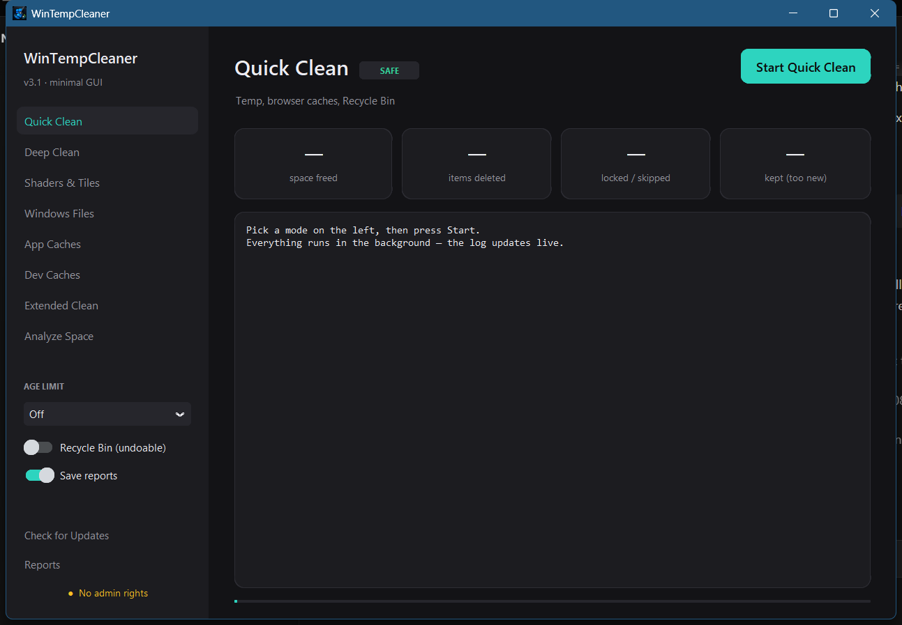
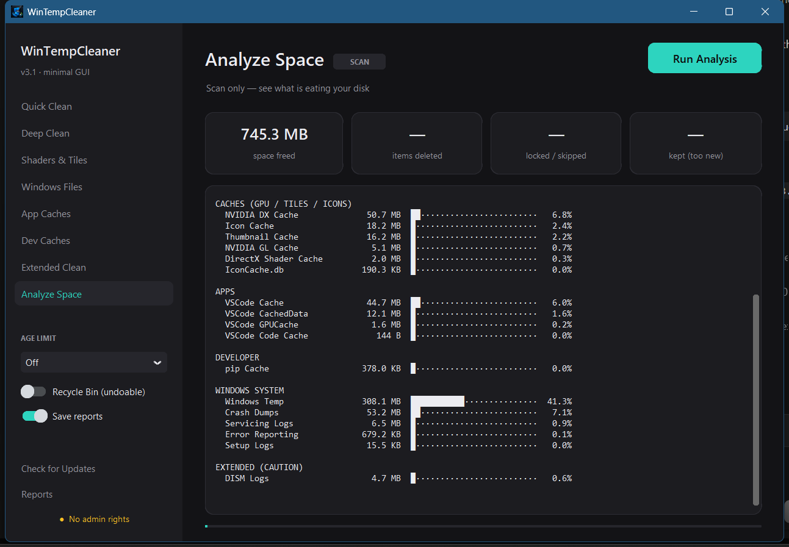
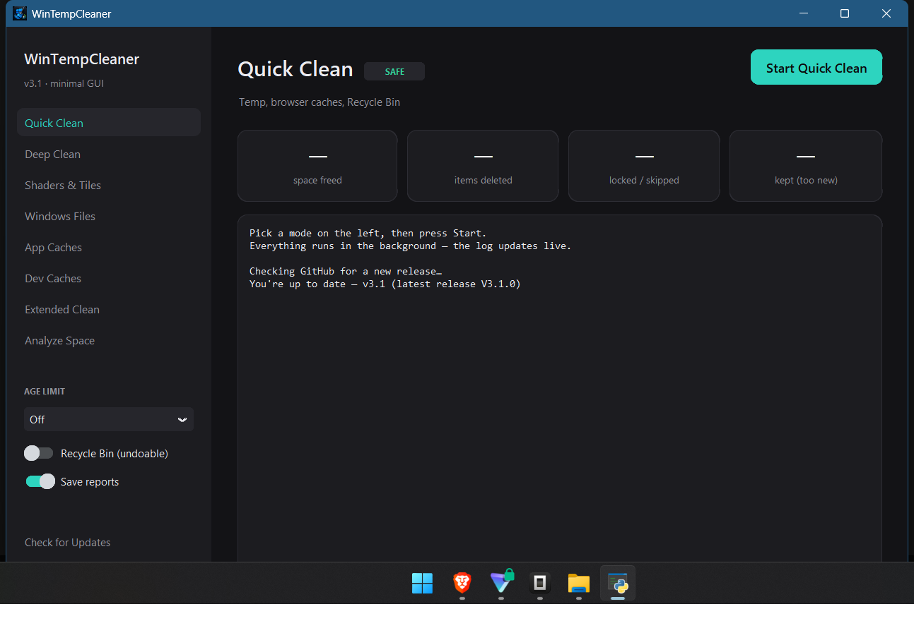

<p align="center">
  
</p>

<h1 align="center">🧹 WinTempCleaner</h1>

<p align="center">
  <strong>A portable Windows temp &amp; cache cleaner — with a minimalistic GUI,<br>a classic CLI, and a one-click self-updater.</strong>
</p>

<p align="center">
  <a href="#-screenshots">Screenshots</a> ·
  <a href="#-cleaning-modes">Modes</a> ·
  <a href="#️-safety-model">Safety</a> ·
  <a href="#-quick-start">Quick start</a> ·
  <a href="#-auto-update-gui">Auto-update</a> ·
  <a href="#-building-from-source">Build</a>
</p>

<p align="center">
  
  
  
  
</p>

---

## 📖 About

WinTempCleaner sweeps temporary files, browser caches, GPU shader caches, app caches, developer caches and system logs — then shows exactly how much space was freed.

- **One file, no install** — grab an `.exe` from [Releases](../../releases/latest), double-click, accept UAC, done.
- **Two interfaces** — a minimalistic dark **GUI** and the classic interactive **CLI**, powered by the same engine.
- **Self-updating** — the GUI compares against GitHub Releases on demand and installs new versions in place. Checks only happen when *you* click: no background polling, no notifications.
- **Safety-first** — tiered cleaning modes, age limits, undoable deletions, locked-file tolerance.

<p align="center">
  
</p>

---

## 🖼️ Screenshots

### Analyze Space

A threaded scan across 50+ locations with grouped size bars — nothing is deleted.

<p align="center">
  
</p>

### Built-in updater

Release notes, installer size and one-click update — straight from GitHub Releases.

<p align="center">
  
</p>

---

## 🧭 Cleaning modes

| Mode | Scope | Safety |
|---|---|---|
| **Quick Clean** | `%TEMP%`, `C:\Windows\Temp`, Prefetch, Chromium & Firefox caches, Recycle Bin | ✅ SAFE |
| **Deep Clean** | Everything safe — Quick + Shaders & Tiles + Windows Files + App Caches + Dev Caches | ✅ SAFE |
| **Shaders & Tiles** | DirectX / NVIDIA shader caches, thumbnail, icon & font caches | ✅ SAFE |
| **Windows Files** | Windows Update cache, Panther/CBS logs, minidumps, WER reports, CrashDumps, MEMORY.DMP | ✅ SAFE |
| **App Caches** | Discord, Slack, Teams (classic + new), Spotify, VSCode, Cursor, Zoom logs | ✅ SAFE |
| **Dev Caches** | npm, pip, NuGet, Gradle, Go build caches | ✅ SAFE |
| **Extended Clean** | Steam shader caches, LiveKernel / DISM / MoSetup debug logs, junk sweep (`*.tmp`, `~$*`, `*.bak`, `*-001.*`) | ⚠️ CAUTION |
| **Analyze Space** | Scan-only report of every tracked location | 🔍 SCAN |

---

## 🛡️ Safety model

Cleaning is split into two tiers:

- **SAFE** — always cleanable: temp dirs, browser/app/dev caches, icon & font caches, shader & thumbnail caches, system logs & dumps.
- **CAUTION** — reachable only through **Extended Clean** and only after an explicit confirmation. Game shader caches recompile on next launch; debug logs are lost forever.

On top of that, two protective layers apply to everything:

| Layer | Default | What it does |
|---|---|---|
| **Age limit** | `1 day` | Only items older than N days (1 / 3 / 7 / 30) are deleted — in-use and session files are never touched. Set `Off` to disable. |
| **Recycle Bin mode** | `Off` | Deletions go to the Recycle Bin instead of being permanent (undoable). Quick/Deep then skip emptying the bin so you can recover items. |

Locked files (held by running apps) are skipped and counted — no Explorer popups, no crashes.

---

## 🚀 Quick start

1. Head to **[Releases](../../releases/latest)** and download:
   - `WindowsTempCleanerGUI-V*.exe` — the **GUI** (recommended)
   - `WindowsTempCleaner-V*.exe` — the **CLI**
2. Double-click the file and accept the UAC prompt (administrator rights let it reach system locations).
3. In the GUI pick a mode → press **Start**. In the CLI type a menu number.

<details>
<summary><strong>CLI menu</strong></summary>

```
  Windows Temp / Cache Cleaner
  Professional Edition - Enhanced             v3.1

  Menu
   1  Quick Clean        - Temp, browser caches, Recycle Bin      SAFE
   2  Deep Clean         - Everything safe (full sweep)           SAFE
   3  Shaders & Tiles    - GPU, thumbnail, icon & font caches     SAFE
   4  Windows Files      - Logs, dumps, update cache              SAFE
   5  App Caches         - Discord, Teams, Spotify, Slack, VSCode SAFE
   6  Dev Caches         - npm, pip, NuGet, Gradle, Go            SAFE
   7  Extended Clean     - Game shaders, debug logs, junk sweep   CAUTION
   8  Analyze Space      - Scan only, detailed report             SAFE
   9  Options            - Age limit, Recycle Bin, reports
   R  Reports            - View past cleanup reports
   Q  Quit
```

</details>

### From source

```batch
pip install customtkinter rich
python temp_cleaner_gui.py
```

---

## 🔄 Auto-update (GUI)

Press **Check for Updates** in the sidebar:

1. The app queries the latest GitHub Release and compares versions.
2. If there's something new you get the release notes and a **Download & Install** button.
3. The new executable replaces the running one in place and the app relaunches.

Design guarantees:

- **On demand only** — checks never run in the background; no timers, no toasts.
- **Extended timeouts + retries** — downloads survive slow or flaky connections (300 s socket timeout, 3 attempts).
- **Safe swap** — the running exe is renamed `.old` before the replacement moves in; failed installs roll back automatically.
- **Source installs** — if you run from source, the button simply opens the releases page.

---

## 📦 Requirements

| | |
|---|---|
| OS | Windows 10 / 11 (x64) |
| Permissions | Administrator (auto-prompted via UAC) |
| Source only | Python 3.10+, [`customtkinter`](https://github.com/TomSchimansky/CustomTkinter), [`rich`](https://github.com/Textualize/rich) |

---

## 🔨 Building from source

CLI:

```batch
pip install pyinstaller rich
pyinstaller --onefile --console --uac-admin --icon "Icon.ico" ^
    --name "WindowsTempCleaner" ^
    temp_cleaner.py
```

GUI:

```batch
pip install pyinstaller customtkinter rich
pyinstaller --onefile --noconsole --uac-admin --icon "Icon.ico" ^
    --collect-all customtkinter ^
    --exclude-module PyQt5 --exclude-module PyQt6 ^
    --exclude-module PySide2 --exclude-module PySide6 ^
    --exclude-module numpy --exclude-module pandas --exclude-module scipy ^
    --exclude-module matplotlib --exclude-module PIL ^
    --exclude-module IPython --exclude-module jedi --exclude-module parso ^
    --exclude-module jupyter --exclude-module notebook ^
    --exclude-module pythonnet --exclude-module clr ^
    --name "WindowsTempCleanerGUI" ^
    temp_cleaner_gui.py
```

> The `--exclude-module` flags stop PyInstaller from bundling unrelated packages
> installed in your global Python environment (~80 MB → ~17 MB).

---

## 🗂️ Files created at runtime

| Path | Purpose |
|---|---|
| `cleaner_config.ini` | Persisted options — age limit, Recycle Bin mode, auto-reports |
| `Reports/*.csv|.json` | Per-run cleanup reports (viewable inside both apps) |
| `cleaner_error.log` | Written only when the CLI crashes unexpectedly |

## 📄 License

[MIT](LICENSE) — free to use, modify and ship.
