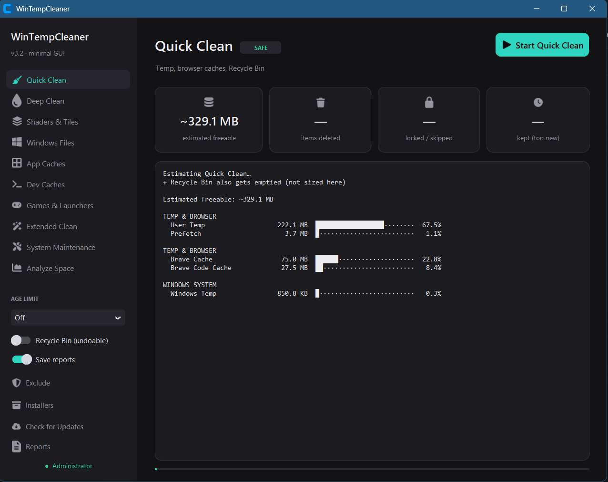
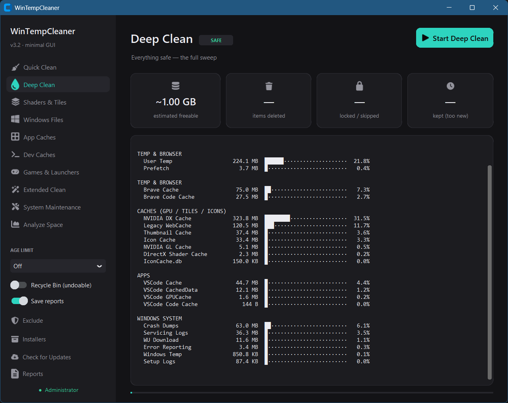
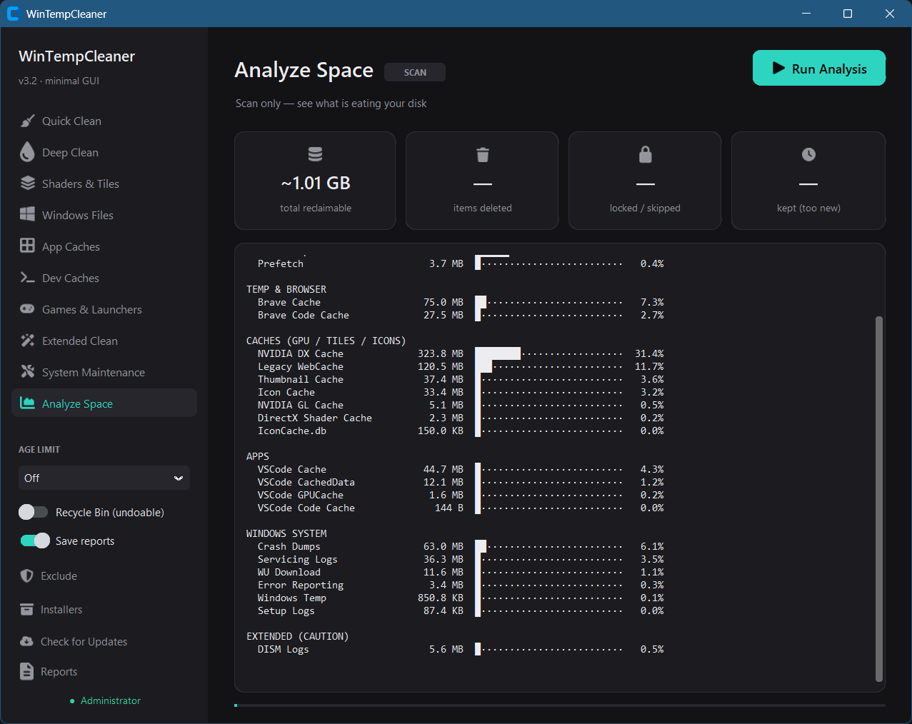
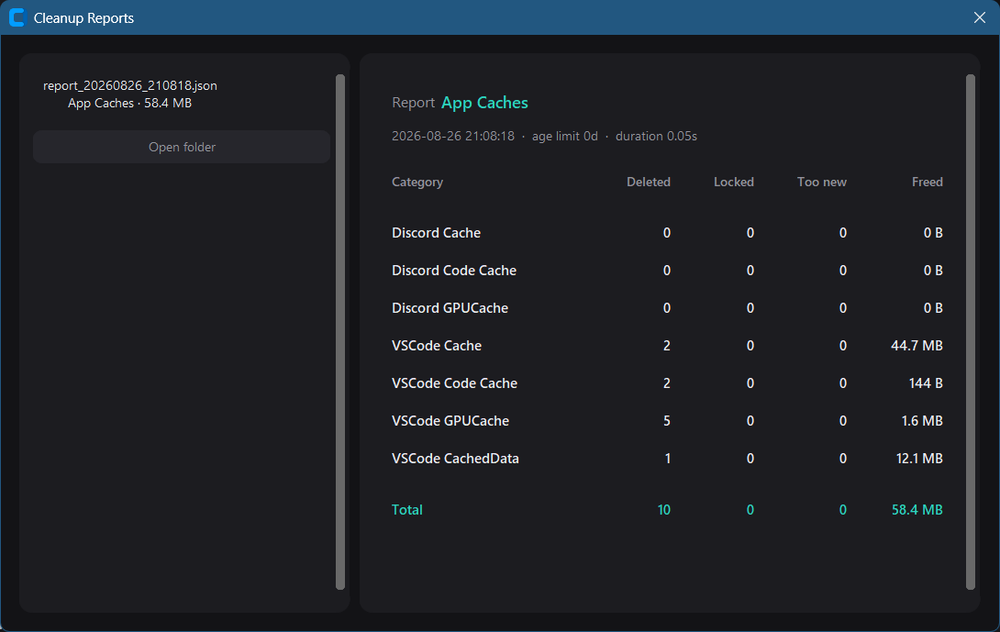
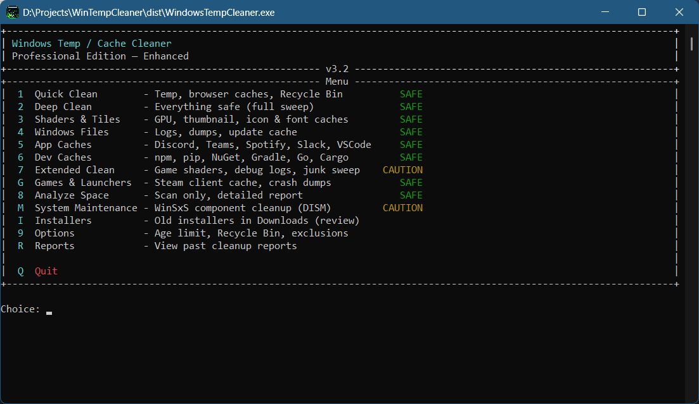
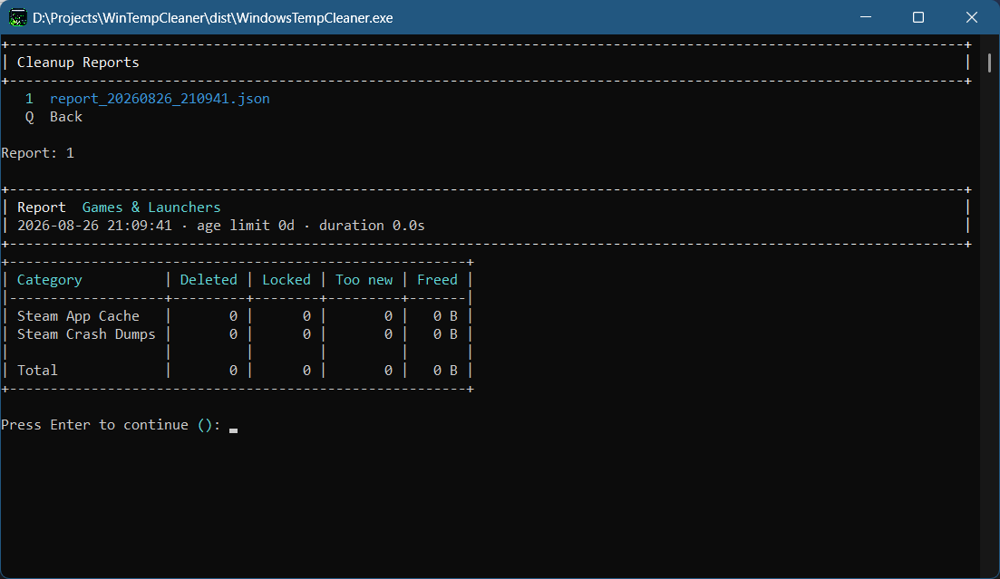

<p align="center">
  
</p>

<h1 align="center">WinTempCleaner</h1>

<p align="center">
  <strong>A portable Windows temp &amp; cache cleaner — with a polished dark GUI,<br>an interactive CLI, and a built-in self-updater.</strong>
</p>

<p align="center">
  <a href="#-screenshots">Screenshots</a> ·
  <a href="#-cleaning-modes">Modes</a> ·
  <a href="#-safety-model">Safety</a> ·
  <a href="#-quick-start">Quick Start</a> ·
  <a href="#-auto-update">Auto-Update</a> ·
  <a href="#-building-from-source">Build</a>
</p>

<p align="center">
  
  
  
  
</p>

---

## About

WinTempCleaner sweeps temporary files, browser caches, GPU shader caches, application caches, developer caches, and system logs — then presents exactly how much space was reclaimed, either in the GUI's visual dashboard or the CLI's rich-formatted tables.

**Zero installation** — download a single `.exe` from [Releases](../../releases/latest), accept the UAC prompt, and you're running. No setup wizard, no registry entries, no background services.

**Two interfaces, one engine** — the same scanning and deletion core powers both a minimalistic dark **GUI** with one-click mode switching and a live preview, and a classic interactive **CLI** with rich-formatted menus and reports.

**On-demand self-updater** — the GUI compares its version against GitHub Releases, shows release notes, and installs the replacement in place with a single click. Checks happen only when you trigger them: no background polling, no notifications.

**Layered safety** — ten cleaning modes with clear safety tiers, an optional age limit, Recycle Bin undo support, a personal exclusion list checked before every deletion, and locked-file tolerance with zero Explorer popups.

---

## Screenshots

### GUI — Quick Clean

One-click temp and cache sweep with live stat cards, grouped size bars, and a scrollable operation log.

<p align="center">
  
</p>

### GUI — Deep Clean

The full safe sweep: every SAFE-tier location in a single pass.

<p align="center">
  
</p>

### GUI — Analyze Space

A read-only threaded scan across 50+ locations with grouped size bars — nothing is deleted.

<p align="center">
  
</p>

### GUI — Reports

Past cleanup results rendered in a structured table with category breakdowns, locked/skipped counts, and freed space per group.

<p align="center">
  
</p>

### CLI — Main Menu

A rich-formatted interactive menu with safety indicators for every mode.

<p align="center">
  
</p>

### CLI — Cleanup Report

A rich-formatted post-cleanup report with per-category stats and totals.

<p align="center">
  
</p>

---

## Cleaning Modes

| Mode | Scope | Safety |
|---|---|---|
| **Quick Clean** | `%TEMP%`, `C:\Windows\Temp`, Prefetch, Chromium & Firefox caches, Recycle Bin | SAFE |
| **Deep Clean** | Everything in Quick + Shaders & Tiles + Windows Files + App Caches + Dev Caches + Games & Launchers | SAFE |
| **Shaders & Tiles** | DirectX / NVIDIA shader caches, thumbnail, icon & font caches, RDP bitmap cache | SAFE |
| **Windows Files** | Windows Update cache, Panther / CBS logs, minidumps, WER reports, CrashDumps, MEMORY.DMP, UWP temp, CHKDSK `FOUND.*` folders | SAFE |
| **App Caches** | Discord, Slack, Teams, Spotify, VSCode, Cursor, Zoom — including DawnCache & Service Worker caches | SAFE |
| **Dev Caches** | npm, pip, NuGet, Gradle, Go module downloads, Cargo registry | SAFE |
| **Games & Launchers** | Steam client cache, crash dumps, web-view cache — no shader recompiles | SAFE |
| **Extended Clean** | Game shader caches, LiveKernel / DISM / MoSetup debug logs, junk sweep (`*.tmp`, `~$*`, `*.bak`, `*-001.*`) | CAUTION |
| **System Maintenance** | WinSxS component cleanup via official DISM `StartComponentCleanup` (no `/ResetBase`) — reported via free-disk-space delta | CAUTION |
| **Analyze Space** | Scan-only report of every tracked location — no files are modified | SCAN |

### Sidebar Tools

- **Installers** — lists `.exe` / `.msi` files in your Downloads folder older than 30 days, sorted by size. Each row has an individual confirm-to-delete button; nothing is removed automatically.
- **Exclude** — manage your personal protected path list. Exclusions are checked before every single deletion, in every mode, regardless of age limit or Recycle Bin setting. Excluded folders are pruned from directory walks entirely.

---

## Safety Model

Cleaning is split into two tiers:

- **SAFE** — always cleanable: temp directories, browser / app / dev caches, icon & font caches, shader & thumbnail caches, system logs and crash dumps. These are regenerated by their respective applications and operating system on demand.
- **CAUTION** — reachable only through **Extended Clean** and **System Maintenance**, and only after an explicit confirmation. Game shader caches will recompile on the next launch. Debug logs are lost permanently. System Maintenance runs the official DISM operation (no manual file deletion) and warns that it may take several minutes.

Three protective layers apply universally:

| Layer | Default | What it does |
|---|---|---|
| **Age limit** | Off | Only items older than N days (1 / 3 / 7 / 30) are deleted. In-use and session files are never touched. Off by default; enable for extra caution. |
| **Recycle Bin** | Off | Deletions go to the Recycle Bin instead of being permanent. Quick / Deep then skip emptying the bin so you can recover items. |
| **Exclusions** | Empty | Personal protected paths — checked before every deletion, in every mode, regardless of all other settings. Excluded folders are pruned from directory walks entirely, not just skipped file-by-file. |

Locked files (held by running applications) are skipped gracefully and counted in the report — no Explorer popups, no crashes. Read-only files (like Go's module cache) have their attribute cleared and the delete retried instead of silently failing.

---

## Quick Start

1. Go to **[Releases](../../releases/latest)** and download:
   - `WindowsTempCleanerGUI.zip` — the **GUI** (recommended)
   - `WindowsTempCleaner.zip` — the **CLI**
2. Extract the `.exe` from the archive.
3. Double-click it and accept the UAC prompt (administrator rights are required to reach system locations).
4. In the GUI, pick a mode from the sidebar and press **Start**. In the CLI, type a menu number.

<details>
<summary><strong>CLI menu</strong></summary>

```
  Windows Temp / Cache Cleaner
  Professional Edition - Enhanced                          v3.2

+----+------------------------------------------------------------+---------
  1  Quick Clean        - Temp, browser caches, Recycle Bin          SAFE
  2  Deep Clean         - Everything safe (full sweep)               SAFE
  3  Shaders & Tiles    - GPU, thumbnail, icon & font caches         SAFE
  4  Windows Files      - Logs, dumps, update cache                  SAFE
  5  App Caches         - Discord, Teams, Spotify, Slack, VSCode     SAFE
  6  Dev Caches         - npm, pip, NuGet, Gradle, Go, Cargo         SAFE
  7  Extended Clean     - Game shaders, debug logs, junk sweep       CAUTION
  G  Games & Launchers  - Steam client cache, crash dumps            SAFE
  8  Analyze Space      - Scan only, detailed report                 SAFE
  M  System Maintenance - WinSxS component cleanup (DISM)            CAUTION
  I  Installers         - Old installers in Downloads (review)
  9  Options            - Age limit, Recycle Bin, exclusions
  R  Reports            - View past cleanup reports

  Q  Quit
```

</details>

### From Source

```batch
pip install customtkinter rich ctkfontawesome pillow
python temp_cleaner_gui.py
```

---

## Auto-Update

Press **Check for Updates** in the GUI sidebar:

1. The app queries the latest GitHub Release and compares version strings.
2. If a newer version exists, you see the release notes, asset size, and a **Download & Install** button.
3. The replacement executable is downloaded, verified, and swapped in place. The app relaunches automatically.

Design guarantees:

| Property | Behaviour |
|---|---|
| **On demand only** | No background timers, no push notifications, no telemetry. |
| **Resilient downloads** | 300 s socket timeout, 3 automatic retries. |
| **Safe swap** | The running `.exe` is renamed to `.old` before the new file moves in. A failed install rolls back automatically. |
| **Source fallback** | Running from source? The button opens the Releases page in your browser instead. |

---

## Requirements

| | |
|---|---|
| OS | Windows 10 / 11 (x64) |
| Permissions | Administrator (auto-prompted via UAC) |
| Source only | Python 3.10+, [`customtkinter`](https://github.com/TomSchimansky/CustomTkinter), [`rich`](https://github.com/Textualize/rich), [`ctkfontawesome`](https://pypi.org/project/ctkfontawesome/) + [`pillow`](https://python-pillow.org) |

---

## Building from Source

CLI:

```batch
pip install pyinstaller rich
pyinstaller WindowsTempCleaner.spec
```

GUI:

```batch
pip install pyinstaller customtkinter rich ctkfontawesome pillow
pyinstaller WindowsTempCleanerGUI.spec
```

> The spec files handle `--collect-all` for CustomTkinter and ctkfontawesome,
> module exclusions, UAC admin manifest, per-executable icons, and Windows
> version-info metadata. Build from the repo root so PyInstaller resolves
> the `.spec` files and icon assets correctly.

---

## Runtime Files

| Path | Purpose |
|---|---|
| `cleaner_config.ini` | Persisted settings — age limit, Recycle Bin mode, auto-reports, protected paths |
| `Reports/*.csv` | Per-run cleanup reports (viewable in both apps; the GUI renders them as a structured table) |
| `cleaner_error.log` | Written only when the CLI encounters an unexpected crash |

---

## License

[MIT](LICENSE) — free to use, modify, and distribute.
